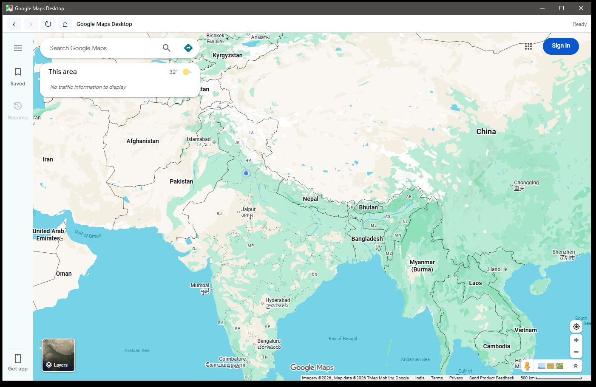
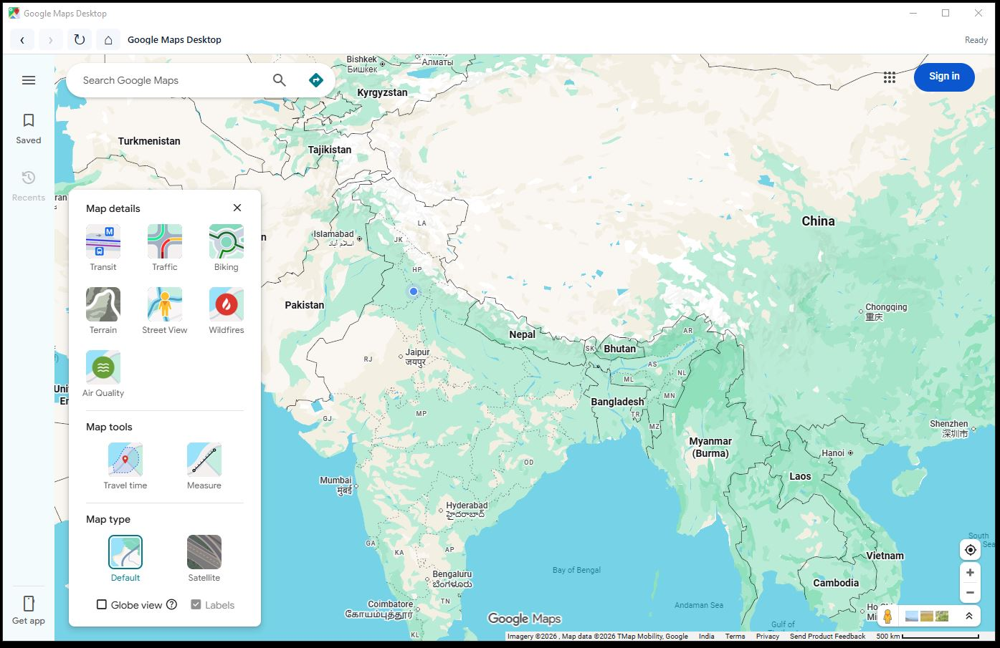

# Google Maps Desktop

Version: 1.0.0

Google Maps Desktop is an unofficial Windows desktop app for Google Maps Web. It opens `https://www.google.com/maps` in its own Electron window so Windows 10 and Windows 11 users can run Google Maps as a focused desktop app.

This project is not affiliated with, endorsed by, or sponsored by Google. It does not copy Google's Android app code, proprietary UI assets, icons, or design files.

## Screenshots

### Google Maps Desktop Home



The main app window loads Google Maps Web directly inside a standalone Windows desktop window with a minimal toolbar for Back, Forward, Refresh, and Home navigation.

### Map Layers and Tools



This screenshot shows Google Maps Web layers and tools available inside the desktop app, including:

- Transit
- Traffic
- Biking
- Terrain
- Street View
- Wildfires
- Air Quality
- Travel time
- Measure
- Default map view
- Satellite map view

Feature availability depends on Google Maps Web, region support, Google account status, and location permission settings.

## Features

- Dedicated Windows desktop window for Google Maps Web.
- Full-height Google Maps layout below a minimal toolbar.
- Back, Forward, Refresh, and Home controls.
- Google Maps Web search, directions, route steps, traffic, transit, satellite, terrain, bicycling, Street View, and crisis/wildfire information where available.
- Current location support through Electron geolocation permission and Windows location services.
- Normal Google sign-in/session behavior through Electron's default persistent session.
- No backend, no custom map engine, and no Google Maps API key.

## Windows Support

- Windows 10
- Windows 11

## Location Permission

For current location to work, Windows must allow desktop apps to access location:

1. Open Windows Settings.
2. Go to Privacy & security > Location.
3. Turn ON Location services.
4. Turn ON Let desktop apps access your location.
5. Restart Google Maps Desktop.

The app allows geolocation requests for Google Maps domains such as `https://www.google.com`, `https://www.google.co.in`, and `https://maps.google.com`. It does not fake, hardcode, or manually calculate your location.

Google Maps Desktop depends on Windows Location Services and the location providers available on the PC. Some Windows desktop systems do not have precise GPS hardware, so Google Maps may only receive an approximate network-based location, or may show a precise-location error until Windows Location services and desktop-app location access are enabled.

For debugging, the Electron main process logs geolocation permission checks and requests, including the requesting origin, whether it was allowed, and the session used by Google Maps.

## Installation

Download the Windows installer from GitHub Releases:

```text
Google Maps Desktop-Setup-1.0.0.exe
```

Run the installer and follow the setup steps. The installer creates Start Menu and desktop shortcuts.

If Windows shows an older icon after reinstalling, delete the old desktop shortcut and install again. Windows can cache shortcut icons; if the old icon still appears, clear the Windows icon cache or rename/rebuild the installer before installing.

The portable build can be run directly without installation:

```text
Google Maps Desktop-Portable-1.0.0.exe
```

## Install Dependencies

```bash
npm install
```

## Run App

```bash
npm start
```

## Build Windows Installer

```bash
npm run build
```

The installer is generated in:

```text
outputs
```

## Build Portable EXE

```bash
npm run build:portable
```

The portable executable is also generated in:

```text
outputs
```

## Project Structure

```text
Google-Maps-Desktop/
  package.json
  package-lock.json
  README.md
  .gitignore
  src/
    main.js
    preload.js
    index.html
    renderer.js
    styles.css
  assets/
    icon.ico
    icon.png
    icon.svg
  outputs/
```

## Notes

Google Maps Desktop is an Electron wrapper around Google Maps Web. It does not use the Google Maps API, does not include a backend, and does not calculate routes manually.

Directions, route steps, traffic, transit, map layers, Street View, sign-in, current location, and regional availability are provided by Google Maps Web. Some features may require Google sign-in.

Do not commit generated `.exe` files to the repository. Upload installer and portable builds to GitHub Releases.
